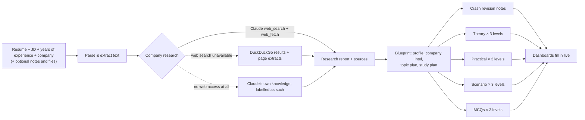

# instant_interview_prep

**InstantInterviewPrep** is an AI agent that turns **your resume + a job description + your years of experience + the
target company** into a complete, personalised interview prep kit. It researches how that company interviews on the
live web, finds the questions candidates actually reported, and builds five study dashboards with 50+ questions,
model answers, scenario walkthroughs and a scored MCQ quiz.

> React (Vite) frontend · Python (FastAPI) backend · Claude agent with live web research.
> Works fully offline in **demo mode** when no API key is configured, which makes it handy as a hackathon fallback.

## What you get

| Dashboard | What's inside |
|---|---|
| **Overview** | Fit summary, strengths and gaps, a ready-to-say "Tell me about yourself" pitch, interview rounds, what the company looks for, questions candidates reported, topic priority, study plan, research report and sources |
| **1. Crash Revision** | One revision sheet per topic: key concepts, explanation, code example, pitfalls, how it is tested, cheat sheet, likely questions |
| **2. Theoretical** | Level-wise (beginner / intermediate / advanced) and 🔥 hot questions, each with a model answer, the key points interviewers listen for, a delivery tip and follow-ups |
| **3. Practical** | Coding, SQL and hands-on problems with the approach, a complete solution, complexity and edge cases |
| **4. Scenario-based** | Real on-the-job situations with a step-by-step framework to tackle them, a model answer, what the interviewer looks for and mistakes to avoid |
| **5. Quiz** | MCQs with instant explanations (why each option is right or wrong), a score, accuracy by topic and attempt history |

Everything is dynamic: the content is generated from your inputs, and every dashboard has **Generate more** for fresh
questions (by level, topic and an optional focus). You can also:

- **Practice mode**: hide the model answers, type your own, and get it scored out of 10 with specific feedback
- **Drill mode**: go through any question bank one card at a time (Space to reveal, ← / → to move, M to mark
  mastered, R for review later), and flip the revision key concepts as flashcards
- **Accounts**: sign up with first name, last name, email and password, or continue with Google; every prep kit is
  private to its owner, with "forgot password" by email
- **Track progress**: mark questions *mastered* or *review later*, mark topics revised, and see readiness meters
- **Export**: download the whole kit as Markdown, or open a print view to save it as a PDF
- Keep a history of prep kits, switch between light and dark themes, and use it on mobile

## How the agent works



1. **Parse** the resume, JD and any attachments (PDF, DOCX, TXT, MD). Claude reads scanned PDFs too.
2. **Research** with Claude's server-side web search and web fetch: interview experiences (Glassdoor, AmbitionBox,
   GeeksforGeeks, LeetCode Discuss, Reddit…), rounds, reported questions, culture and recent news. Every search,
   page read and progress note streams into the live agent log.
3. **Blueprint**: a structured-output call matches your resume to the JD and the research. It produces your strengths
   and gaps, your pitch, the interview rounds and a weighted topic plan.
4. **Generate in parallel**: revision notes plus theory, practical, scenario and quiz batches at each level. The level
   mix follows your experience (freshers get more fundamentals, seniors more advanced and leadership questions).
   Questions reported for the company are marked 🔥 with their source.
5. **Dashboards unlock as soon as each section is ready**, so you can start reading while the agent is still writing.

| Prep depth | Theory | Practical | Scenario | MCQs | Topics |
|---|---|---|---|---|---|
| Quick | 15 | 10 | 10 | 15 | 8 |
| Standard (default) | 24 | 15 | 15 | 25 | 10 |
| Deep | 36 | 21 | 21 | 36 | 14 |

## Quick start

**Prerequisites:** Python 3.10+, Node.js 20.19+ (or 22.12+). An [Anthropic API key](https://console.anthropic.com) is
needed for AI mode; without one the app runs in demo mode.

### Option A: one command (development)

```bash
./scripts/dev.sh          # macOS / Linux / Git Bash
.\scripts\dev.ps1         # Windows PowerShell
```

The script creates the virtualenv, installs dependencies and copies `backend/.env.example` to `backend/.env`. It then
starts the API on :8000 and the app on **http://localhost:5173**.

### Option B: step by step

```bash
# 1. backend
cd backend
python3 -m venv .venv                # Windows: python -m venv .venv
source .venv/bin/activate            # Windows: .venv\Scripts\Activate.ps1
pip install -r requirements.txt
cp .env.example .env                 # Windows: copy .env.example .env  -> then add ANTHROPIC_API_KEY
uvicorn app.main:app --reload --reload-include .env --port 8000

# 2. frontend (second terminal)
cd frontend
npm install
npm run dev                          # open http://localhost:5173
```

### Single server (for demos and deployment)

```bash
cd frontend && npm run build                      # produces frontend/dist
cd ../backend && uvicorn app.main:app --port 8000 # serves the API and the app on http://localhost:8000
```

### Docker

```bash
ANTHROPIC_API_KEY=sk-ant-... docker compose up --build    # omit the key for demo mode
# open http://localhost:8000  (data persists in the prep-data volume)
```

## AI mode vs demo mode

| | AI mode (`ANTHROPIC_API_KEY` set) | Demo mode (no key) |
|---|---|---|
| Company research | Live web search and page reading, with sources | None (generic interview process, clearly labelled) |
| Questions and answers | Freshly generated for your resume, JD, company and experience | Picked from a built-in 13-topic knowledge base matched to your JD and resume |
| Hot questions | Questions reported online for the company + very common staples | Classic, frequently asked staples |
| Generate more | New content, with an optional focus | Unused knowledge-base content |
| Answer feedback | Claude grades your answer and rewrites an improved version | Keyword coverage scoring against the key points |
| Time for a standard kit | A few minutes, depending on model, effort and rate limits (sections appear progressively) | A few seconds |

The demo knowledge base covers Python, SQL, Statistics and A/B testing, Machine Learning, Deep Learning, NLP and GenAI,
Data Engineering, Cloud and MLOps, BI, DSA, System Design, Case Studies and Guesstimates, and Behavioural/HR.

## Accounts and sign-in

Visitors who aren't signed in land on the sign-in page. Accounts live in the app's own database, so there is no
third-party auth service to pay for:

- **Email and password**: passwords are hashed with Argon2id; sessions are random tokens in an httpOnly,
  SameSite=Lax cookie (stored hashed on the server), lasting 30 days with "Keep me signed in" or until the browser
  closes without it. Sign-in, sign-up and reset requests are rate-limited, and state-changing API calls from other
  sites are refused.
- **Continue with Google**: the standard OAuth 2.0 authorization-code flow with PKCE, state and nonce. Google's ID
  token is verified on the server. If an account with the same verified email exists, Google is linked to it.
- **Forgot password**: a single-use link valid for 60 minutes is emailed; using it signs you out on other devices.
- **Your data**: each prep kit belongs to the account that created it. Kits made before accounts existed are given to
  the first account created.

### Turn on Google sign-in and password-reset email

Both are free, but they need credentials that only the site's owner can create: a Google OAuth client and an email
account to send from. Until they are configured, the server says so in its log, a local install shows its owner a
setup note on the sign-in page, and a live site (with `PREP_APP_URL` set) hides the Google button.

**The quick way: the setup wizard.** It shows exactly what to click, checks each value live (it asks Google whether
the client ID and secret are valid and sends you a real test email) and saves `backend/.env`, keeping a backup:

```bash
cd backend
python -m app.setup_auth            # Windows: .venv\Scripts\python -m app.setup_auth
python -m app.setup_auth --check    # later: re-check the saved settings (changes nothing, sends nothing)
```

Restart the backend afterwards (`scripts/dev.ps1` and `scripts/dev.sh` restart it automatically when `.env` changes).
The server also checks both integrations every time it starts and logs the exact problem if something is wrong.

**By hand: Continue with Google (about 5 minutes).**

1. Open [Google Auth Platform → Clients](https://console.cloud.google.com/auth/clients) in Google Cloud and create a
   project if asked. If the platform isn't configured yet, click **Get started**: app name, support email,
   Audience *External*, contact email.
2. **Create client** → type *Web application* → under **Authorized redirect URIs** add:
   - `http://localhost:5173/api/auth/google/callback` (development with `npm run dev`)
   - `http://localhost:8000/api/auth/google/callback` (the built app served by FastAPI)
   - `https://YOUR-DOMAIN/api/auth/google/callback` (production)
3. Copy the client ID and secret into `backend/.env` as `PREP_GOOGLE_CLIENT_ID` and `PREP_GOOGLE_CLIENT_SECRET`.
4. **Audience**: while the app is in *Testing*, only the test users you add there can sign in; click **Publish app**
   to open it to everyone (basic sign-in with `openid`, `email` and `profile` needs no Google review).

**By hand: password-reset email.** Any SMTP provider works. The quickest free option is Gmail (about 500 emails a day):

1. Turn on [2-Step Verification](https://myaccount.google.com/signinoptions/twosv), then create an App Password at
   <https://myaccount.google.com/apppasswords> (your normal Gmail password won't work).
2. In `backend/.env` set `PREP_SMTP_HOST=smtp.gmail.com`, `PREP_SMTP_USER=you@gmail.com`,
   `PREP_SMTP_PASSWORD=<the 16-letter app password>` and `PREP_SMTP_FROM="InstantInterviewPrep <you@gmail.com>"`.
3. Send yourself a test: `python -m app.setup_auth --test-email you@gmail.com`.

For a custom sender domain, Brevo's free plan (300 emails a day) works the same way with
`PREP_SMTP_HOST=smtp-relay.brevo.com`. Without SMTP settings, a local install prints reset links in the backend log.

### Production checklist

- Set `PREP_APP_URL=https://your-domain` (reset links and the Google callback use it; cookies become HTTPS-only).
- Serve the app over HTTPS behind your proxy and run uvicorn with `--proxy-headers`.
- Add the production redirect URI to the Google OAuth client and publish the consent screen.
- Run `python -m app.setup_auth --check` on the server: both lines should say OK.

## Configuration (`backend/.env`)

| Variable | Default | Purpose |
|---|---|---|
| `ANTHROPIC_API_KEY` | *(empty)* | Enables AI mode |
| `PREP_CLAUDE_MODEL` | `claude-opus-5-5` | Model for research and generation (e.g. `claude-sonnet-5-5` for faster, cheaper runs) |
| `PREP_CLAUDE_EFFORT` | `medium` | Thinking effort for generation: `low` … `max` (lower is faster and cheaper) |
| `PREP_RESEARCH_EFFORT` | `medium` | Thinking effort for the research step |
| `PREP_ENABLE_WEB_SEARCH` | `true` | Use Claude's web search/fetch (falls back to DuckDuckGo automatically) |
| `PREP_ENABLE_FALLBACKS` | `true` | Server-side refusal fallbacks (a declined request is retried on a fallback model) |
| `PREP_MAX_CONCURRENCY` | `6` | Parallel Claude calls; lower it if you hit rate limits |
| `PREP_DEMO_MODE` | `false` | Force demo mode even with a key |
| `PREP_DEMO_STEP_DELAY` | `0.6` | Seconds between demo steps (so the agent timeline is visible) |
| `PREP_DATA_DIR` | `backend/data` | Where the SQLite database lives |
| `PREP_MAX_UPLOAD_MB` | `10` | Upload size limit per file |
| `PREP_APP_URL` | *(empty)* | Public URL of the site; required in production |
| `PREP_GOOGLE_CLIENT_ID`, `PREP_GOOGLE_CLIENT_SECRET` | *(empty)* | Enable "Continue with Google" |
| `PREP_SMTP_HOST`, `PREP_SMTP_PORT`, `PREP_SMTP_SECURITY`, `PREP_SMTP_USER`, `PREP_SMTP_PASSWORD`, `PREP_SMTP_FROM` | `587`, `starttls` | Email for password resets |
| `PREP_COOKIE_SECURE` | automatic | HTTPS-only cookies (on when `PREP_APP_URL` is https) |
| `PREP_SESSION_DAYS` | `30` | How long "Keep me signed in" lasts |

The new-prep form also has a checkbox to run a single kit in demo mode when a key is set.

## API

| Method & path | Description |
|---|---|
| `POST /api/auth/register`, `POST /api/auth/login`, `POST /api/auth/logout`, `GET /api/auth/me` | Accounts (session cookie) |
| `GET /api/auth/google/start`, `GET /api/auth/google/callback` | Continue with Google (OAuth 2.0 + PKCE) |
| `POST /api/auth/forgot-password`, `GET`/`POST /api/auth/reset-password` | Password reset by email |
| `GET /api/health` | Mode (ai/demo), model, web-search flag, counts per depth |
| `GET /api/sample` | Sample inputs (fictional candidate) for "Try a sample" |
| `POST /api/sessions` | Multipart form: `company`, `years_experience`, `resume_file` or `resume_text`, `jd_file` or `job_description`, optional `role`, `extra_notes`, `extra_files[]`, `depth`, `mode` |
| `GET /api/sessions` | List your prep kits (every `/api/sessions` route needs a signed-in user) |
| `GET /api/sessions/{id}` | Full kit: content, progress, user state, quiz attempts |
| `GET /api/sessions/{id}/status` | Lightweight progress for polling (steps, live log, sources, ready sections) |
| `POST /api/sessions/{id}/generate` | `{section, count, level, topic, focus}`: generate more questions or a new revision topic |
| `POST /api/sessions/{id}/evaluate` | `{section, item_id, answer}`: score a practice answer |
| `PUT /api/sessions/{id}/state` | Mark a question mastered/review, or a topic revised |
| `POST /api/sessions/{id}/quiz-attempts` | Save a quiz score |
| `GET /api/sessions/{id}/export.md` | Download the whole kit as Markdown |
| `POST /api/sessions/{id}/retry` | Regenerate a kit |
| `DELETE /api/sessions/{id}` | Delete a kit |

Interactive API docs are served at `http://localhost:8000/docs`.

## Project structure

```
backend/
  app/
    main.py                 FastAPI routes (+ serves frontend/dist when built)
    agent/
      llm.py                Claude client: streaming, structured outputs, web research, refusal fallbacks
      research.py           live web research -> DuckDuckGo fallback -> model-knowledge fallback
      prompts.py, schemas.py  prompts and JSON schemas for every generation step
      pipeline.py           orchestration: research -> blueprint -> parallel generation -> top-up
      plan.py               depth targets, experience-based level mix, batching
      progress.py           live progress timeline, log and incremental results
      actions.py            generate-more and answer evaluation
      demo.py               offline demo agent (knowledge base + heuristic profile and feedback)
    knowledge_base/         13 offline topics (revision notes + questions at three levels)
    auth.py, accounts.py    sign-up/sign-in, Google OAuth, password reset, sessions
    mailer.py, ratelimit.py SMTP email and sign-in rate limits
    setup_auth.py           python -m app.setup_auth: guided setup and live checks for Google + email
    parsing.py, storage.py, models.py, export.py, samples.py
  tests/                    pytest suite (API, accounts, units, AI pipeline with a fake Claude client)
frontend/
  src/pages/                AuthPage (sign in/up, reset), Landing, NewPrep, Workspace, Overview, Revision,
                            QuestionBank, Quiz, History, PrintView
  src/auth.jsx              signed-in state and route guards
  src/components/           question cards, drill deck, practice panel, filters, agent progress, charts, dialogs…
  src/styles/               design tokens (light/dark, a colour identity per dashboard) and per-area stylesheets
  src/hooks/, src/lib/      session polling, scroll helpers, motion presets, progress and formatting helpers
scripts/                    dev.sh / dev.ps1
Dockerfile, docker-compose.yml
```

## Tests

```bash
cd backend
pip install -r requirements-dev.txt
pytest            # 82 tests; the AI pipeline and Google sign-in use fakes (no key or network needed)
```

## Demo script for the hackathon

1. Sign in (or create an account), then click **Try a live sample** on the landing page (or **Build my prep kit** to use your own resume
   and JD), then **Build my prep kit** on the form.
2. Show the **live agent log**: searches, pages read and sources appear as the agent researches the company.
3. Open **Overview** while the rest generates: the pitch, the gaps, the interview rounds and the topic priority (click
   a bar to jump to its revision notes).
4. **Theoretical**: filter *Advanced* + *Hot only*, turn on **Practice mode**, type an answer and show the AI feedback.
5. **Scenario-based**: walk through the step-by-step approach for one question.
6. **Quiz**: take a 5-question quiz, then show the score, accuracy by topic and the "Revise next" links.
7. **Generate more** on any dashboard, then **Export Markdown** / **Print**.

## Notes

- **Privacy:** everything is stored in SQLite on your server (`backend/data/prep.db`) and each kit is visible only
  to its owner. In AI mode, your resume, JD and notes are sent to the Anthropic API to generate the kit.
- **Research quality** depends on what has been publicly reported about the company. The agent is instructed never
  to attribute a question to a source that didn't contain it, and it labels research that comes from model knowledge.
- **Cost and time** scale with depth, model and effort. For faster, cheaper kits, use `PREP_CLAUDE_EFFORT=low` or
  `PREP_CLAUDE_MODEL=claude-sonnet-5-5`.
